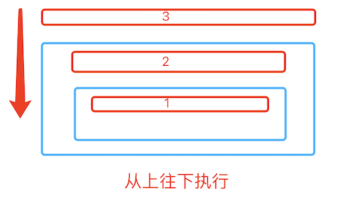
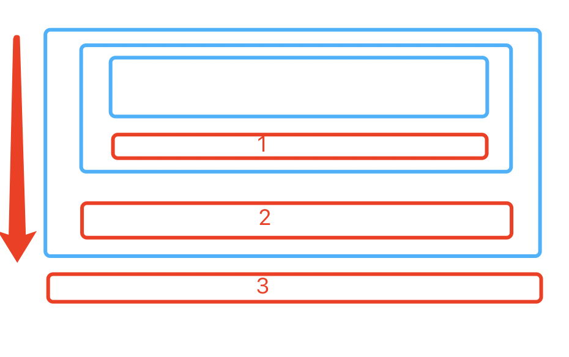
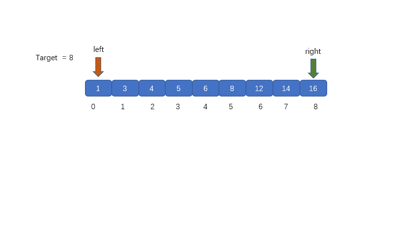
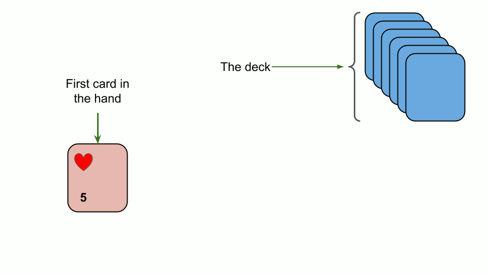
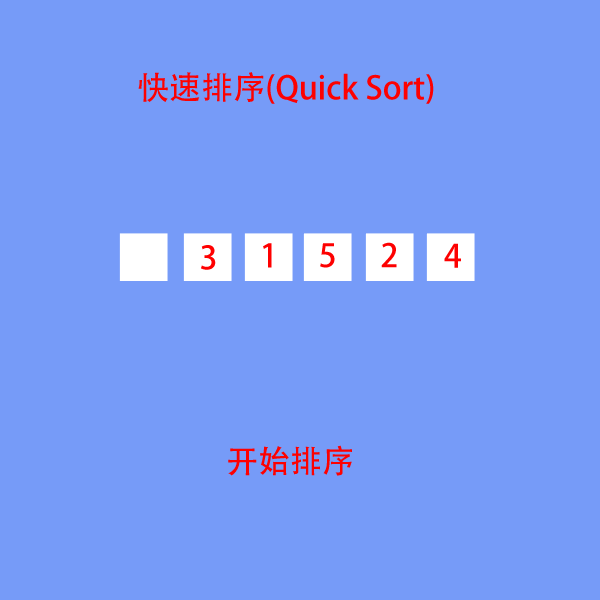
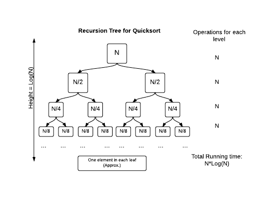

# 算法&数据结构
### 时间复杂度（Time complexity）
在计算机科学中，算法的时间复杂度（Time complexity）是一个函数，它定性描述该算法的运行时间。
### 空间复杂度
在计算机科学中，一个算法或程序的空间复杂度定性地描述该算法或程序运行所需要的存储空间大小。

------
### 一、递归
程序调用自身的编程技巧称为递归（ recursion）。递归作为一种算法在程序设计语言中广泛应用。 一个过程或函数在其定义或说明中有直接或间接调用自身的一种方法，它通常把一个大型复杂的问题层层转化为一个与原问题相似的规模较小的问题来求解，递归策略只需少量的程序就可描述出解题过程所需要的多次重复计算，大大地减少了程序的代码量。递归的能力在于用有限的语句来定义对象的无限集合。一般来说，递归需要有边界条件、递归前进段和递归返回段。当边界条件不满足时，递归前进；当边界条件满足时，递归返回。


```python
def recursion(i):
    if i > 0:
        print(i)
        recursion(i-1)
recursion(3)
# 输出结果：1、2、3
```


```python
def recursion2(i):
    if i > 0:
        recursion2(i-1)
        print(i)
# 输出结果：3、2、1
```

#### 汉诺塔
   法国数学家爱德华·卢卡斯曾编写过一个印度的古老传说：在世界中心贝拿勒斯（在印度北部）的圣庙里，一块黄铜板上插着三根宝石针。印度教的主神梵天在创造世界的时候，在其中一根针上从下到上地穿好了由大到小的64片金片，这就是所谓的汉诺塔。不论白天黑夜，总有一个僧侣在按照下面的法则移动这些金片：一次只移动一片，不管在哪根针上，小片必须在大片上面。僧侣们预言，当所有的金片都从梵天穿好的那根针上移到另外一根针上时，世界就将在一声霹雳中消灭，而梵塔、庙宇和众生也都将同归于尽。


 - 1、把n-1个盘子从a通过c移动到b
 - 2、把第n个盘从a移动到c
 - 3、把n-1个盘子从b通过a移动到c

```python
def hanoi(n,a,b,c):
    if n > 0:
        hanoi(n-1,a,c,b)
        print(('moving %s from %s'),(a,c))
        hanoi(n-1,b,a,c)

hanoi(3,'A','B','C')
```

------
### 二、常用查找与排序算法
#### 顺序查找(Linear Search)  时间复杂度：o(n)
顺序查找：也叫线性查找，从列表第一个元素开始，顺序进行搜索，知道找到元素或搜索到列表最后一个元素为止。


```python
def linear_search(li,val):
    for i,v in enumerate(li):
        if v == val:
            return i
    else:
         return None
```

#### 二分查找法（binary_search） 时间复杂度：O（log2n）
在一个已知有序队列中找出与给定关键字相同的数的具体位置。原理是分别定义三个指针low、high、mid分别指向待查元素所在范围的下界和上界以及区间的中间位置，即mid＝（low＋high）/2，让关键字与mid所指的数比较，若等则查找成功并返回mid，若关键字小于mid所指的数则high=mid-1，否则low=mid+1，然后继续循环直到找出或找不到为止。



````python
def binary_search(li,val):
    left = 0
    right = len(li) - 1
    while right >= left:    #候选区有值
        mid = (left + right) // 2
        if li[mid] == val:
            return mid
        elif li[mid] > val:  #候选区在mid左边
            right = mid - 1
        else:   #li[mid] < val 候选区在mid右边
            left = mid + 1
    else:
        return None
````
### 排序
#### 冒泡排序（Bubble Sort) 时间复杂度：o(n^2)
 - 比较相邻的元素。如果第一个比第二个大，就交换他们的位置。


```python
def bubble_sort(li):
    for i in range(len(li) - 1):    #第i躺
        exchange = False
        for j in range(len(li) - i -1):
            if li[j] > li[j+1]:
                li[j],li[j+1] = li[j+1],li[j]   #交换位置
                exchange = True
        if not exchange:
            return
```

#### 选择排序（Selection sort）时间复杂度：O(n^2)
首先在未排序序列中找到最小（大）元素，存放到排序序列的起始位置，然后，再从剩余未排序元素中继续寻找最小（大）元素，然后放到已排序序列的末尾。以此类推，直到所有元素均排序完毕。


```python
def selection_sort(li):
    for i in range(len(li)-1):    #第i趟
        min_loc = i
        for j in range(i+1,len(li)):
            if li[j] < li[min_loc]:
                min_loc = j     #将最小值赋值给min_loc
        li[min_loc] , li[i] = li[i] , li[min_loc]   #待排序区域最小值放到元素开始下标
```

#### 插入排序（Insertion sort） 时间复杂度：o(n^2)
假设你在玩扑克牌，你要把牌按从小到大排列。当你拿到第一张牌，那它就是最小的，把它放在第一个位置上。当你拿到第二张牌，你和第一张牌做比较，如果它大于第一张牌，则把它放到第一张牌的右边，反之则放到左边。当你拿到第三张牌，你拿它和第二个位置上的牌比较，然后如有必要需要和第一个位置上的牌比较。然后是第四张牌……最后，一手牌就按从小到大的顺序排好了。这就是插入排序。 在其实现过程使用双层循环，外层循环对除了第一个元素之外的所有元素，内层循环对当前元素前面有序表进行待插入位置查找，并进行移动



```python
def insert_sort(li):
    for i in range(1,len(li)):  #i为发到手上的牌
        tmp = li[i] 
        j = i - 1   #手上的牌
        while j >= 0 and li[j] > tmp:   #将大的牌向右移
            li[j+1] = li[j]
            j -= 1
        li[j+1] = tmp
```

#### 快速排序(Quicksort) 时间复杂度：o(N*logN)
快速排序，又称划分交换排序（partition-exchange sort），简称快排，一种排序算法，最早由东尼·霍尔提出。在平均状况下，排序n个项目要O(n log2 n)次比较。在最坏状况下则需要 O(n^2)次比较，但这种状况并不常见。事实上，快速排序 (n log n)通常明显比其他算法更快，因为它的内部循环（inner loop）可以在大部分的架构上很有效率地达成。



快速排序思路：
   - 取一个元素p(第一个元素)，使元素p归位
   - 列表被p分成两部分，左边都比p小，右边都比p大
   - 递归完成排序

```python
def partition(li, left, right):
    tmp = li[left]
    while left < right:
        while left < right and li[right] >= tmp:    #从右边开始找比tmp小的数
            right -= 1  #向左走一步
        li[left] = li[right]    #把右边小于tmp的值写到左边空位上
        while left < right and li[left] <= tmp:     #从左边开始找比tmp大的数
            left += 1  #向右走一步
        li[right] = li[left]    #把左边大于tmp的值写到左边空位上
    li[left] = tmp  #将tmp归位
    return left

def quick_sort(li, left, right):
    if left < right:
        mid = partition(li,left,right)
        quick_sort(li, left, mid-1)
        quick_sort(li, mid+1,right)
```



快速排序的最坏情况
 - 列表已按相同顺序排序
 - 列表已按相反顺序排序
 - 所有元素都相同（情况1和情况2的特例）

解决办法：随机选取中心轴下标。