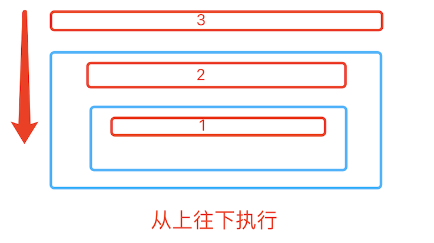

# 数据结构+算法
### 时间复杂度
是指执行当前算法所消耗的时间。
### 空间复杂度
是指执行当前算需要占用多少内存空间。

------
### 一、递归
程序调用自身的编程技巧称为递归（ recursion）。递归作为一种算法在程序设计语言中广泛应用。 一个过程或函数在其定义或说明中有直接或间接调用自身的一种方法，它通常把一个大型复杂的问题层层转化为一个与原问题相似的规模较小的问题来求解，递归策略只需少量的程序就可描述出解题过程所需要的多次重复计算，大大地减少了程序的代码量。递归的能力在于用有限的语句来定义对象的无限集合。一般来说，递归需要有边界条件、递归前进段和递归返回段。当边界条件不满足时，递归前进；当边界条件满足时，递归返回。


```python
def recursion(i):
    if i > 0:
        print(i)
        recursion(i-1)
recursion(3)
# 输出结果：1、2、3
```


```python
def recursion2(i):
    if i > 0:
        recursion2(i-1)
        print(i)
# 输出结果：3、2、1
```

#### 汉诺塔
   法国数学家爱德华·卢卡斯曾编写过一个印度的古老传说：在世界中心贝拿勒斯（在印度北部）的圣庙里，一块黄铜板上插着三根宝石针。印度教的主神梵天在创造世界的时候，在其中一根针上从下到上地穿好了由大到小的64片金片，这就是所谓的汉诺塔。不论白天黑夜，总有一个僧侣在按照下面的法则移动这些金片：一次只移动一片，不管在哪根针上，小片必须在大片上面。僧侣们预言，当所有的金片都从梵天穿好的那根针上移到另外一根针上时，世界就将在一声霹雳中消灭，而梵塔、庙宇和众生也都将同归于尽。


 - 1、把n-1个盘子从a通过c移动到b
 - 2、把第n个盘从a移动到c
 - 3、把n-1个盘子从b通过a移动到c

```python
def hanoi(n,a,b,c):
    if n > 0:
        hanoi(n-1,a,c,b)
        print(('moving %s from %s'),(a,c))
        hanoi(n-1,b,a,c)

hanoi(3,'A','B','C')
```

------
### 二、常用查找与排序算法
#### 顺序查找(Linear Search)  时间复杂度：o(n)
顺序查找：也叫线性查找，从列表第一个元素开始，顺序进行搜索，知道找到元素或搜索到列表最后一个元素为止。


```python
def linear_search(li,val):
    for i,v in enumerate(li):
        if v == val:
            return i
    else:
         return None
```

#### 二分查找法（binary_search） 时间复杂度：O（log2n）
在一个已知有序队列中找出与给定关键字相同的数的具体位置。原理是分别定义三个指针low、high、mid分别指向待查元素所在范围的下界和上界以及区间的中间位置，即mid＝（low＋high）/2，让关键字与mid所指的数比较，若等则查找成功并返回mid，若关键字小于mid所指的数则high=mid-1，否则low=mid+1，然后继续循环直到找出或找不到为止。


````python
def binary_search(li,val):
    left = 0
    right = len(li) - 1
    while right >= left:    #候选区有值
        mid = (left + right) // 2
        if li[mid] == val:
            return mid
        elif li[mid] > val:  #候选区在mid左边
            right = mid - 1
        else:   #li[mid] < val 候选区在mid右边
            left = mid + 1
    else:
        return None
````
### 排序
#### 冒泡排序（Bubble Sort) 时间复杂度：o(n*n)
 - 比较相邻的元素。如果第一个比第二个大，就交换他们的位置。


```python
def bubble_sort(li):
    for i in range(len(li) - 1):    #第i躺
        exchange = False
        for j in range(len(li) - i -1):
            if li[j] > li[j+1]:
                li[j],li[j+1] = li[j+1],li[j]   #交换位置
                exchange = True
        if not exchange:
            return
```


