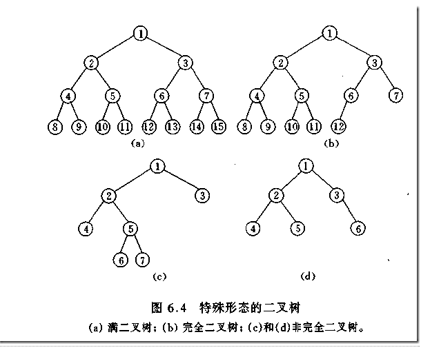

# 算法&数据结构
### 时间复杂度（Time complexity)
在计算机科学中，算法的时间复杂度（Time complexity）是一个函数，它定性描述该算法的运行时间。
### 空间复杂度(Space Complexity)
在计算机科学中，一个算法或程序的空间复杂度定性地描述该算法或程序运行所需要的存储空间大小。


## 一、递归
程序调用自身的编程技巧称为递归（ recursion）。递归作为一种算法在程序设计语言中广泛应用。 一个过程或函数在其定义或说明中有直接或间接调用自身的一种方法，它通常把一个大型复杂的问题层层转化为一个与原问题相似的规模较小的问题来求解，递归策略只需少量的程序就可描述出解题过程所需要的多次重复计算，大大地减少了程序的代码量。递归的能力在于用有限的语句来定义对象的无限集合。一般来说，递归需要有边界条件、递归前进段和递归返回段。当边界条件不满足时，递归前进；当边界条件满足时，递归返回。


```python
def recursion(i):
    if i > 0:
        print(i)
        recursion(i-1)
recursion(3)
# 输出结果：1、2、3
```


```python
def recursion2(i):
    if i > 0:
        recursion2(i-1)
        print(i)
# 输出结果：3、2、1
```

### 汉诺塔
   法国数学家爱德华·卢卡斯曾编写过一个印度的古老传说：在世界中心贝拿勒斯（在印度北部）的圣庙里，一块黄铜板上插着三根宝石针。印度教的主神梵天在创造世界的时候，在其中一根针上从下到上地穿好了由大到小的64片金片，这就是所谓的汉诺塔。不论白天黑夜，总有一个僧侣在按照下面的法则移动这些金片：一次只移动一片，不管在哪根针上，小片必须在大片上面。僧侣们预言，当所有的金片都从梵天穿好的那根针上移到另外一根针上时，世界就将在一声霹雳中消灭，而梵塔、庙宇和众生也都将同归于尽。


 - 1、把n-1个盘子从a通过c移动到b
 - 2、把第n个盘从a移动到c
 - 3、把n-1个盘子从b通过a移动到c

```python
def hanoi(n,a,b,c):
    if n > 0:
        hanoi(n-1,a,c,b)
        print(('moving %s from %s'),(a,c))
        hanoi(n-1,b,a,c)

hanoi(3,'A','B','C')
```


## 二、常用查找与排序算法
### 顺序查找(Linear Search)  时间复杂度：o(n)
顺序查找：也叫线性查找，从列表第一个元素开始，顺序进行搜索，知道找到元素或搜索到列表最后一个元素为止。


```python
def linear_search(li,val):
    for i,v in enumerate(li):
        if v == val:
            return i
    else:
         return None
```

### 二分查找法（binary_search） 时间复杂度：O（log2n）
在一个已知有序队列中找出与给定关键字相同的数的具体位置。原理是分别定义三个指针low、high、mid分别指向待查元素所在范围的下界和上界以及区间的中间位置，即mid＝（low＋high）/2，让关键字与mid所指的数比较，若等则查找成功并返回mid，若关键字小于mid所指的数则high=mid-1，否则low=mid+1，然后继续循环直到找出或找不到为止。


````python
def binary_search(li,val):
    left = 0
    right = len(li) - 1
    while right >= left:    #候选区有值
        mid = (left + right) // 2
        if li[mid] == val:
            return mid
        elif li[mid] > val:  #候选区在mid左边
            right = mid - 1
        else:   #li[mid] < val 候选区在mid右边
            left = mid + 1
    else:
        return None
````


## 三、排序
排序也称排序算法(Sort Algorithm)，排序是将一组数据，依指定的顺序进行排列的过程。

### 冒泡排序（Bubble Sort) 时间复杂度：o(n^2)
 - 比较相邻的元素。如果第一个比第二个大，就交换他们的位置。


```python
def bubble_sort(li):
    for i in range(len(li) - 1):    #第i躺
        exchange = False
        for j in range(len(li) - i -1):
            if li[j] > li[j+1]:
                li[j],li[j+1] = li[j+1],li[j]   #交换位置
                exchange = True
        if not exchange:
            return
```

### 选择排序（Selection sort）时间复杂度：O(n^2)
首先在未排序序列中找到最小（大）元素，存放到排序序列的起始位置，然后，再从剩余未排序元素中继续寻找最小（大）元素，然后放到已排序序列的末尾。以此类推，直到所有元素均排序完毕。


```python
def selection_sort(li):
    for i in range(len(li)-1):    #第i趟
        min_loc = i
        for j in range(i+1,len(li)):
            if li[j] < li[min_loc]:
                min_loc = j     #将最小值赋值给min_loc
        li[min_loc] , li[i] = li[i] , li[min_loc]   #待排序区域最小值放到元素开始下标
```

### 插入排序（Insertion sort） 时间复杂度：o(n^2)
假设你在玩扑克牌，你要把牌按从小到大排列。当你拿到第一张牌，那它就是最小的，把它放在第一个位置上。当你拿到第二张牌，你和第一张牌做比较，如果它大于第一张牌，则把它放到第一张牌的右边，反之则放到左边。当你拿到第三张牌，你拿它和第二个位置上的牌比较，然后如有必要需要和第一个位置上的牌比较。然后是第四张牌……最后，一手牌就按从小到大的顺序排好了。这就是插入排序。 在其实现过程使用双层循环，外层循环对除了第一个元素之外的所有元素，内层循环对当前元素前面有序表进行待插入位置查找，并进行移动


```python
def insert_sort(li):
    for i in range(1,len(li)):  #i为发到手上的牌
        tmp = li[i] 
        j = i - 1   #手上的牌
        while j >= 0 and li[j] > tmp:   #将大的牌向右移
            li[j+1] = li[j]
            j -= 1
        li[j+1] = tmp
```

### 快速排序(Quicksort) 时间复杂度：o(N*logN)
快速排序，又称划分交换排序（partition-exchange sort），简称快排，一种排序算法，最早由东尼·霍尔提出。在平均状况下，排序n个项目要O(n log2 n)次比较。在最坏状况下则需要 O(n^2)次比较，但这种状况并不常见。事实上，快速排序 (n log n)通常明显比其他算法更快，因为它的内部循环（inner loop）可以在大部分的架构上很有效率地达成。


快速排序思路：
   - 取一个元素p(第一个元素)，使元素p归位
   - 列表被p分成两部分，左边都比p小，右边都比p大
   - 递归完成排序

```python
def partition(li, left, right):
    tmp = li[left]
    while left < right:
        while left < right and li[right] >= tmp:    #从右边开始找比tmp小的数
            right -= 1  #向左走一步
        li[left] = li[right]    #把右边小于tmp的值写到左边空位上
        while left < right and li[left] <= tmp:     #从左边开始找比tmp大的数
            left += 1  #向右走一步
        li[right] = li[left]    #把左边大于tmp的值写到左边空位上
    li[left] = tmp  #将tmp归位
    return left

def quick_sort(li, left, right):
    if left < right:
        mid = partition(li,left,right)
        quick_sort(li, left, mid-1)
        quick_sort(li, mid+1,right)
```


快速排序的最坏情况
 - 列表已按相同顺序排序
 - 列表已按相反顺序排序
 - 所有元素都相同（情况1和情况2的特例）

解决办法：随机选取中心轴下标。

### 堆排序
堆排序（英语:Heapsort）是指利用堆这种数据结构所设计的一种排序算法。堆是一个近似完全二叉树的结构，并同时满足堆积的性质：即子结点的键值或索引总是小于（或者大于）它的父节点

#### 关于树
树（Tree）是一种抽象数据类型，或是实现这种抽象数据类型的数据结构，用来模拟具有树状结构性质的数据集合。一般由N个有限节点组合，具有层次关系。


树是一种可以递归定义的数据结构

树是由n个节点组成的集合：
- 如果n=0，那么这是一颗空树；
- 如果n>0，那存在1个节点作为树的根节点，其他节点可以分为m个集合，每个集合本身又是一棵树。

#### 树具有的特点
 - 每个节点有零个或多个子节点
 - 没有父节点的节点称为根
 - 每个非根节点有且只有一个父节点
 - 除了根节点以外，每个子节点又可以分为多个不相交的子树

#### 二叉树（Binary tree）
二叉树是指树中节点的度不大于2(两颗子树)的有序树

基于二叉树，又可分为满二叉树和完全二叉树

- 满二叉树

   一个二叉树，如果每一个层的结点树都达到最大值，则这个二叉树就是二叉树


- 完全二叉树

  若设二叉树的深度为h，除第h层外，其他各层（1～（h-1）层）的节点树都达到最大个数，第h层所有的节点都连续集中在最左边，这就是完全二叉树



#### 二叉树的存储方法（表示方式）
- 链式存储方式

- 顺序存储方式


子节点和父节点的关系
- 父节点计算左子节点：2i+1
- 父节点计算右子节点：2i+2
- 子节点计算父节点下标：（i-1）//2

#### 什么是堆（heap）
堆：一种特殊的完全二叉树结构
- 大根堆：一颗完全二叉树，满足任一节点都比其孩子节点大
- 小根堆：一颗完全二叉树，满足任一节点都比其孩子节点小


#### 堆的向下调整
根节点的左右子树都是堆，根节点所在的树自身不是堆。可以通过一次向下调整变成一个堆。
- 若想将其调整为小堆，那么根结点的左右子树必须都为小堆。
- 若想将其调整为大堆，那么根结点的左右子树必须都为大堆。


```python
def sift(li,low,high):
    """
    :param li: 列表
    :param low: 堆的根节点位置
    :param high: 堆最后一个元素的位置
    :return:
    """
    i = low #i最开始指向根节点
    j = 2 * i + 1   #j是左孩子
    tmp = li[low]     #将堆顶的值存起来
    while j <= high:    #j的值不能超过堆的最后一个元素
        if j + 1 <= high and li[j+1] > li[j]: #如果有右孩子并且比左孩子大，就把j指向右孩子
            j += 1
        if li[j] > tmp: #如果孩子大于堆顶，就交换他们的位置
            li[i] = li[j]
            i = j       #将i指向新的堆顶，向下看一层
            j = 2 * i +1    #根据堆顶求出左孩子
        else:
            break
    li[i] = tmp #如果j超过了high，或者孩子小于堆顶，就把tmp放回原位置
```

#### 堆排序的实现 时间复杂度o（nlogn）
- 将最后一个元素和堆顶交换位置，每次将最后一个元素向前移动一位
- 做堆的向下调整


```python
def heap_sort(li):
    n = len(li)
    # 构建堆
    for i in range((n-2)//2,-1,-1): #i表示建堆时部分根下标
        sift(li,i,n-1)  #将堆的最后一个元素作为high
    for i in range(n-1 ,-1 ,-1):    #i指当前堆的最后一个元素
        li[i] ,li[0] = li[0] ,li[i] #把当前堆顶和堆的最后一个元素交换位置
        sift(li ,0 ,i - 1)
```

#### 堆排序的应用（topk ）
现在有n个数，设计算法得到前k大的数。（k<n）

解决思路：
- 排序后切片       o(nlogn)
- 排序LowB三人组   o(kn)
- 堆排序          o(nlogk)
  - 取列表前k个元素建立一个小根堆。堆顶就是目前第k大的数；
  - 依次向后遍历原列表，对于列表中的元素，如果小于堆顶，则忽略该元素；如果大于堆顶，则将堆顶更换为该元素，并且对堆进行依次调整；
  - 遍历列表所有元素后，倒序弹出堆顶

```python
def sift(li,low,high):
    i = low
    j = 2 * i +1
    tmp = li[i]
    while j <= high:
        if j+1 <= high and li[j+1] < li[j]:
            j +=1
        if li[j] < tmp:
            li[i] = li[j]
            i = j
            j = 2*i+1
        else:
            break
    li[i] = tmp

def heap_topk(li,k):
    heap = li[0:k]
    for i in range((k-2)//2 ,-1 ,-1):
        sift(heap ,i ,k-1)

    # 1、构建堆
    for i in range(k ,len(li)-1):
        if li[i] > heap[0]:
            heap[0] = li[i]
            sift(heap,0,k-1)

    #2、遍历
    for i in range(k-1 ,-1 ,-1):
        heap[0] ,heap[i] = heap[i] ,heap[0]
        sift(heap ,0 ,i-1)

    # 出数
    return heap
```

### 归并排序 
- 时间复杂度o(n*logn) 
- 空间复杂度o(n)
归并排序（英语：Merge sort，或mergesort），是创建在归并操作上的一种有效的排序算法。1945年由约翰·冯·诺伊曼首次提出。该算法是采用分治法（Divide and Conquer）的一个非常典型的应用，且各层分治递归可以同时进行。

归并排序思路：
- 分解
- 排序
- 归并

#### 归并（将两个有序列表，归并成一个有序的列表）


```python
def merge(li ,low ,mid ,high):
    i = low
    j = mid+1
    ltmp = []   # 用于临时存放排序好的列表
    # 左右两边都有数
    while i <= mid and j <= high:   # 如果左边部分小于mid并且右边部分小于high
        if li[i] < li[j]:   # 选出左右两边小的值
            ltmp.append(li[i])  # 将左边值添加到新的列表
            i += 1  # 将下标往后移动
        else:
            ltmp.append(li[j])
            j += 1
    # 有可能右边没数，但左边还有数
    while i <= mid:
        ltmp.append(li[i])
        i += 1
    # 有可能左边没数，但右边还有数
    while j <= high:
        ltmp.append(li[j])
        j += 1
    li[low:high+1] = ltmp
```
#### 归并排序实现
归并排序的核心思想其实很简单，如果要排序一个列表，我们先把列表从中间分成前后两部分，然后分别对前后两部分进行排序，再将排好序的两部分数据合并在一起就可以了。


```python
def merge_sort(li ,low ,high):
    if low < high:      #至少有两个数
        mid = (low + high)//2
        merge_sort(li,low,mid)
        merge_sort(li,mid+1,high)
        merge(li ,low ,mid ,high)
```

### 希尔排序
希尔排序(Shell's Sort)是插入排序的一种又称“缩小增量排序”（Diminishing Increment Sort），是直接插入排序算法的一种更高效的改进版本。希尔排序是非稳定排序算法。

希尔排序的基本思想是：先将整个待排序的记录序列分割成为若干子序列分别进行直接插入排序，待整个序列中的记录"基本有序"时，再对全体记录进行依次直接插入排序。


```python
import random
from cal_time import *

def insertion_sort_gap(li ,gap):
    for i in range(gap,len(li)):
        tmp = li[i]
        j = i - gap
        while j >= 0 and li[j] > tmp:
            li[j+gap] = li[j]
            j -= gap
        li[j+gap] = tmp

@cal_time
def shell_sort(li):
    d =len(li) // 2
    while d >= 1:
        insertion_sort_gap(li,d)
        d //= 2
```

### 计数排序
计数排序是一个非基于比较的排序算法，该算法于1954年由 Harold H. Seward 提出。它的优势在于在对一定范围内的整数排序时，它的复杂度为Ο(n+k)（其中k是整数的范围），快于任何比较排序算法。 [1]  当然这是一种牺牲空间换取时间的做法，而且当O(k)>O(n*log(n))的时候其效率反而不如基于比较的排序（基于比较的排序的时间复杂度在理论上的下限是O(n*log(n)), 如归并排序，堆排序）


对列表进行排序，已知列表中的数范围都在0-100之间。设计时间复杂度为o(n)的算法

```python
def count_sort(li,max_count=100):
    count = [0 for i in range(max_count+1)]
    for val in li:
        count[val] += 1
    li.clear()
    for i ,val in enumerate (count):
        for j in range(val):
            li.append(i)
```

### 桶排序（Bucket Sort）
桶排序 (Bucket sort)或所谓的箱排序，是一个排序算法，工作的原理是将数组分到有限数量的桶子里。每个桶子再个别排序（有可能再使用别的排序算法或是以递归方式继续使用桶排序进行排序）。桶排序是鸽巢排序的一种归纳结果。当要被排序的数组内的数值是均匀分配的时候，桶排序使用线性时间（Θ（n））。但桶排序并不是 比较排序，他不受到 O(n log n) 下限的影响。


```python
def bucket_sort(li ,n=100 ,max_num=10000):
    buckets=[[] for _ in range(n)]  #创建桶
    for var in li:
        i = min(var//(max_num//n),n-1)
        buckets[i].append(var) #往对应的桶添加数据
        # 保持桶里的顺序
        for j in range(len(buckets[i])-1 ,0 ,-1):
            if buckets[i][j] < buckets[i][j-1]:
                buckets[i][j-1],buckets[i][j] = buckets[i][j],buckets[i][j-1]

            else:
                break
    sort_li = []
    # 将所有桶放到sort_li 列表
    for buc in buckets:
        sort_li.extend(buc) #将这个列表数据添加到sort_li列表中
    return sort_li
```

### 基数排序(英语：Radix sort)
基数排序是一种非比较型整数排序算法，其原理是将整数按位数切割成不同的数字，然后按每个位数分别比较。由于整数也可以表达字符串（比如名字或日期）和特定格式的浮点数，所以基数排序也不是只能使用于整数。

它是这样实现的：将所有待比较数值（正整数）统一为同样的数位长度，数位较短的数前面补零。然后，从最低位开始，依次进行一次排序。这样从最低位排序一直到最高位排序完成以后，数列就变成一个有序序列。

基数排序的方式可以采用LSD（Least significant digital）或MSD（Most significant digital），LSD的排序方式由键值的最右边开始，而MSD则相反，由键值的最左边开始。


<center>基数排序过程</center>

```python
def radix_sort(li):
    max_num = max(li)
    it =0
    # 10的it次方
    while 10 ** it <= max_num:
        buckets = [[] for _ in range(10)]
        # 1、把对应的数据放到对应的桶
        for var in li:
            # max_num = 974；取十位，it=1，974//10 --> 97 % 10 -->7
            digit = (var//10 ** it) % 10
            buckets[digit].append(var)

        # 2、将原来的li列表清空
        li.clear()
        # 3、将新的列表放回li列表
        for buc in buckets:
            li.extend(buc)
        it += 1
```


