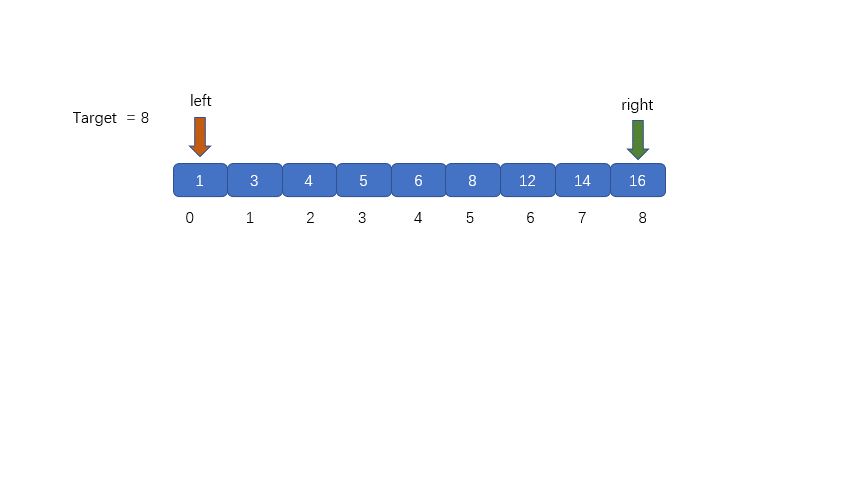

# 常用查找算法
## 顺序查找(Linear Search)  时间复杂度：o(n)
**顺序查找也叫线性查找，从列表第一个元素开始，顺序进行搜索，知道找到元素或搜索到列表最后一个元素为止。**


```python
def linear_search(li,val):
    for i,v in enumerate(li):
        if v == val:
            return i
    else:
         return None
```

## 二分查找法（binary_search） 时间复杂度：O（log2n）
**在一个已知有序队列中找出与给定关键字相同的数的具体位置。原理是分别定义三个指针low、high、mid分别指向待查元素所在范围的下界和上界以及区间的中间位置，即mid＝（low＋high）/2，让关键字与mid所指的数比较，若等则查找成功并返回mid，若关键字小于mid所指的数则high=mid-1，否则low=mid+1，然后继续循环直到找出或找不到为止。**



````python
def binary_search(li,val):
    left = 0
    right = len(li) - 1
    while right >= left:    #候选区有值
        mid = (left + right) // 2
        if li[mid] == val:
            return mid
        elif li[mid] > val:  #候选区在mid左边
            right = mid - 1
        else:   #li[mid] < val 候选区在mid右边
            left = mid + 1
    else:
        return None
````
