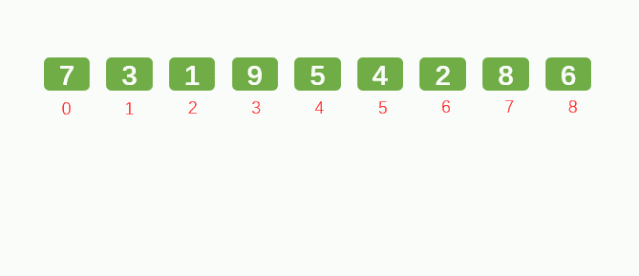

## 希尔排序
**希尔排序(Shell's Sort)是插入排序的一种又称“缩小增量排序”（Diminishing Increment Sort），是直接插入排序算法的一种更高效的改进版本。希尔排序是非稳定排序算法。**

**希尔排序的基本思想是**：先将整个待排序的记录序列分割成为若干子序列分别进行直接插入排序，待整个序列中的记录"**基本有序**"时，再对全体记录进行依次直接插入排序。



```python
import random
from cal_time import *

def insertion_sort_gap(li ,gap):
    for i in range(gap,len(li)):
        tmp = li[i]
        j = i - gap
        while j >= 0 and li[j] > tmp:
            li[j+gap] = li[j]
            j -= gap
        li[j+gap] = tmp

@cal_time
def shell_sort(li):
    d =len(li) // 2
    while d >= 1:
        insertion_sort_gap(li,d)
        d //= 2
```

## 计数排序
**计数排序是一个非基于比较的排序算法，该算法于1954年由 Harold H. Seward 提出。它的优势在于在对一定范围内的整数排序时，它的复杂度为Ο(n+k)（其中k是整数的范围），快于任何比较排序算法。 [1]  当然这是一种牺牲空间换取时间的做法，而且当O(k)>O(n*log(n))的时候其效率反而不如基于比较的排序（基于比较的排序的时间复杂度在理论上的下限是O(n*log(n)), 如归并排序，堆排序）**


#### 对列表进行排序，已知列表中的数范围都在0-100之间；设计时间复杂度为o(n)的算法。

```python
def count_sort(li,max_count=100):
    count = [0 for i in range(max_count+1)]
    for val in li:
        count[val] += 1
    li.clear()
    for i ,val in enumerate (count):
        for j in range(val):
            li.append(i)
```

## 桶排序（Bucket Sort）
**桶排序 (Bucket sort)或所谓的箱排序，是一个排序算法，工作的原理是将数组分到有限数量的桶子里。每个桶子再个别排序（有可能再使用别的排序算法或是以递归方式继续使用桶排序进行排序）。桶排序是鸽巢排序的一种归纳结果。当要被排序的数组内的数值是均匀分配的时候，桶排序使用线性时间（Θ（n））。但桶排序并不是 比较排序，他不受到 O(n log n) 下限的影响。**


```python
def bucket_sort(li ,n=100 ,max_num=10000):
    buckets=[[] for _ in range(n)]  #创建桶
    for var in li:
        i = min(var//(max_num//n),n-1)
        buckets[i].append(var) #往对应的桶添加数据
        # 保持桶里的顺序
        for j in range(len(buckets[i])-1 ,0 ,-1):
            if buckets[i][j] < buckets[i][j-1]:
                buckets[i][j-1],buckets[i][j] = buckets[i][j],buckets[i][j-1]

            else:
                break
    sort_li = []
    # 将所有桶放到sort_li 列表
    for buc in buckets:
        sort_li.extend(buc) #将这个列表数据添加到sort_li列表中
    return sort_li
```

## 基数排序(Radix sort)
**基数排序是一种非比较型整数排序算法，其原理是将整数按位数切割成不同的数字，然后按每个位数分别比较。由于整数也可以表达字符串（比如名字或日期）和特定格式的浮点数，所以基数排序也不是只能使用于整数。**

它是这样实现的：将所有待比较数值（正整数）统一为同样的数位长度，数位较短的数前面补零。然后，从最低位开始，依次进行一次排序。这样从最低位排序一直到最高位排序完成以后，数列就变成一个有序序列。

基数排序的方式可以采用LSD（Least significant digital）或MSD（Most significant digital），LSD的排序方式由键值的最右边开始，而MSD则相反，由键值的最左边开始。


```python
def radix_sort(li):
    max_num = max(li)
    it =0
    # 10的it次方
    while 10 ** it <= max_num:
        buckets = [[] for _ in range(10)]
        # 1、把对应的数据放到对应的桶
        for var in li:
            # max_num = 974；取十位，it=1，974//10 --> 97 % 10 -->7
            digit = (var//10 ** it) % 10
            buckets[digit].append(var)

        # 2、将原来的li列表清空
        li.clear()
        # 3、将新的列表放回li列表
        for buc in buckets:
            li.extend(buc)
        it += 1
```

## 查找排序练习
### [两数之和](https://leetcode-cn.com/problems/two-sum/)
**给定一个整数数组 nums 和一个整数目标值 target，请你在该数组中找出 和为目标值 target  的那 两个 整数，并返回它们的数组下标。**

**你可以假设每种输入只会对应一个答案。但是，数组中同一个元素在答案里不能重复出现。**

**你可以按任意顺序返回答案。**

```python
class two_Sum:
    def twoSum(self, nums: List[int], target: int) -> List[int]:
        li =[]
        for i in range(len(nums)):
            for j in range(i+1,len(nums)):
                if nums[j]+nums[i] == target:
                    li.append(j)
                    li.append(i)
                    return li
```
