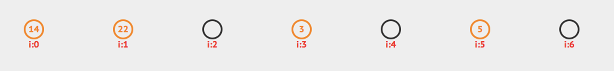
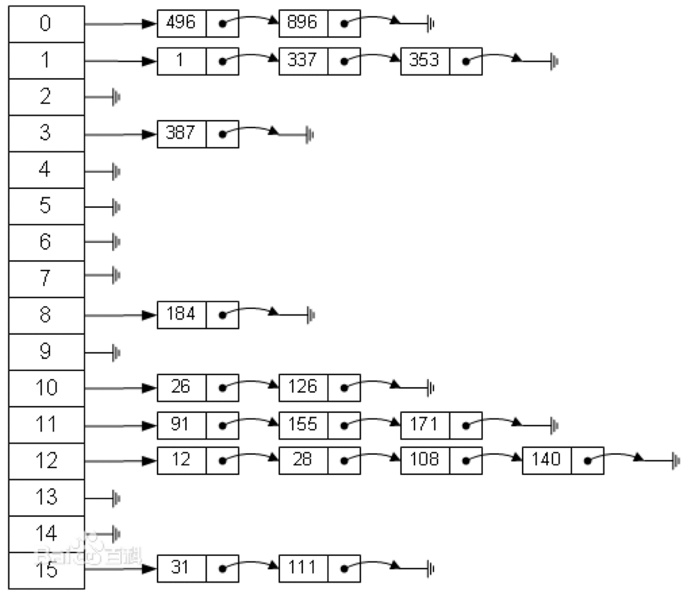

# 哈希表
哈希表(Hash Table，又为散列表)，是一种线性表的存储结构。哈希表由一个顺序表(数组)和一个哈希函数组成。哈希函数h(k)将元素k作为自变量，返回元素的存储下标。

- 假设有一个长度为7的数组，哈希函数h(k)=k%7。元素集合{14,22,3,5}的存储方式如下图

 

## 哈希冲突
由于哈希表的大小是有限的，而要存储的值的总数量是无限的，因此对于任何哈希函数，都会出现两个不同元素映射到同一个位置上的情况，这种情况叫做哈希冲突。

- 比如h(k)=k%7, h(0)=h(7)=h(14)=...


## 解决哈希冲突

### 开放寻址法
**开放寻址法：如果哈希函数返回的位置已经有值，则可以向后探查新的位置来存储这个值。**
- 线性探查：如果位置i被占用，则探查i+1, i+2,……
- 二次探查：如果位置i被占用，则探查i+12,i-12,i+22,i-22,……
- 二度哈希：有n个哈希函数，当使用第1个哈希函数h1发生冲突时，则尝试使用h2,h3,……

### 拉链法
拉链法：哈希表每个位置都连接一个链表，当冲突发生时，冲突的元素将被加到该位置链表的最后



## 常见哈希函数
- 除法哈希法：h(k) = k%m
- 乘法哈希法：h(k) = floor(m*(A*key%1))
- 全域哈希法：ha,b(k) = ((a*key + b) % p) % m   a,b=1,2,...,p-1

## 通过链表实现哈希表

```python

class LinkList:
    class Node:
        def __init__(self, item):
            self.item = item
            self.next = None

    class LinkListIterator:
        def __init__(self, node):
            self.node = node

        def __next__(self):
            if self.node:
                cur_node = self.node
                self.node = cur_node.next
                return cur_node.item
            else:
                raise StopIteration

        def __iter__(self):
            return self

    def __init__(self, iterable=None):
        self.head = None
        self.tail = None
        if iterable:
            self.extend(iterable)

    def append(self, obj):
        s = LinkList.Node(obj)
        if not self.head:
            self.head = s
            self.tail = s
        else:
            self.tail.next = s
            self.tail = s

    def extend(self, iterable):
        for obj in iterable:
            self.append(obj)

    def find(self, obj):
        for n in self:
            if n == obj:
                return True
        else:
            return False

    def delete(self, value):
        node = self.head
        tmp = None
        while node:
            if node.item == value:
                tmp.next = node.next
                return True
            tmp = node
            node = node.next

    def __iter__(self):
        return self.LinkListIterator(self.head)

    def __repr__(self):
        return "【" + ", ".join(map(str, self)) + "】"

class HashTable:
    def __init__(self, size=10):
        self.size = size
        self.T = [LinkList() for _ in range(self.size)]

    def hash(self, k):
        return k % self.size

    def insert(self, k):
        i = self.hash(k)
        if self.find(k):
            print("重复插入")
        else:
            self.T[i].append(k)

    def delete(self, k):
        i = self.hash(k)
        return self.T[i].delete(k)

    def find(self, k):
        i = self.hash(k)
        return self.T[i].find(k)
```

## 哈希表在Python中的应用
- Python字典与集合都是通过哈希表实现的
- md5算法
- SHA2算法
