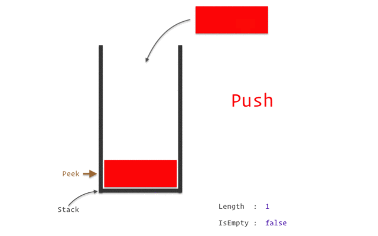

## 栈(Stack)
**栈是一个数据集合，可以理解为只能在一端进行插入或删除操作的列表。**

**栈的特点：后进先出LIFO(last-in,first-out)**

**栈的概念：栈顶、栈底**

#### 栈额基本操作：

- 进栈：push
- 出栈：pop
- 取栈顶：gettop

## 栈的实现
**使用一般的列表结构即可实现栈**



```python
class Stack:

    def __init__(self):
        self.stack = []

    def push(self, element):
        self.stack.append(element)

    def pop(self):
        return self.stack.pop()

    def get_top(self):
        if len(self.stack) > 0:
            return self.stack[-1]
        else:
            return None
```

## 栈的应用--括号匹配问题
**括号匹配问题：给一个字符串，其中包含小括号、中括号、大括号，求该字符串的括号是否匹配。**

例如：
- ()()[]{}  匹配
- ([{])     不匹配
- ([{}])    匹配
- ]         不匹配  

```python
class Stack:
    def __init__(self):
        self.stack = []

    def push(self,element):
        self.stack.append(element)

    def pop(self):
        return self.stack.pop()

    def gettop(self):
        if len(self.stack) > 0:
            return self.stack[-1]
        else:
            return None

    def is_empty(self):
        return len(self.stack) == 0

def brackets_match(str):
    brackets = {'}':'{', ']':"[", ')':'('}
    stack = Stack()
    for ch in str:
        # 查看ch是否存在'(','[','{'
        if ch in {'(','[','{'}:
            stack.push(ch)
        else:
            if stack.is_empty():
                return False
            # 拿栈顶和当前值比较
            elif stack.gettop() == brackets[ch]:
                stack.pop()
            else:   #if stack.pop() != brackets[ch]
                return False
    # 如果列表为空返回true
    if stack.is_empty():
        return True
    else:
        return False
```
