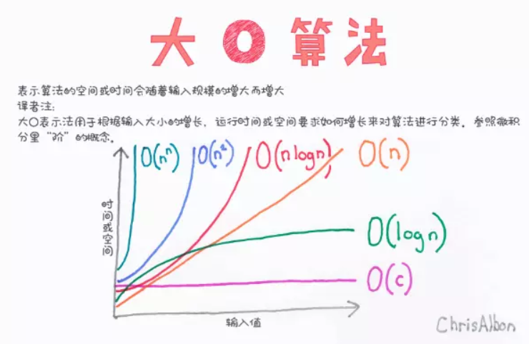

## 算法

**算法是一组完成任务的指令。**

- 时间复杂度（Time complexity)

  在计算机科学中，算法的时间复杂度是一个函数，它定性描述该算法的运行时间。
- 空间复杂度(Space Complexity)

  在计算机科学中，一个算法或程序的空间复杂度定性地描述该算法或程序运行所需要的存储空间大小。

### 常用算法

- **检索：**检索就是在数据结构里查找满足一定条件的节点。一般是给定一个某字段的值，找具有该字段值的节点。
- **插入：**往数据结构中增加新的节点。
- **删除：**把指定的结点从数据结构中去掉。
- **更新：**改变指定节点的一个或多个字段的值。
- **排序：**把节点按某种指定的顺序重新排列。例如递增或递减。

## 数据结构

**数据结构是指相互之间存在着一种或多种关系的数据元素的集合和该集合中数据元素之间的关系组成。**

简单的来说，数据结构就是设计数据以任何一种方式组织并存储在计算机中。比如：列表、集合与字典等都是一种数据结构。

**N.Wirth："程序=数据结构+算法"**

### 数据结构的分类

**数据结构按照其逻辑结构可分为线性结构、树结构、图结构**

- 线性结构：数据结构中的元素存在一对一的互相关系
- 树结构：数据结构的元素存在一对多的相互关系
- 图结构：数据结构中的元素存在多对多的相互关系

### 常见数据结构

- **栈（Stack）：**栈是一种特殊的线性表，它只能在一个表的一个固定端进行数据结点的插入和删除操作。
- **队列（Queue）：**队列和栈类似，也是一种特殊的线性表。和栈不同的是，队列只允许在表的一端进行插入操作，而在另一端进行删除操作。
- **数组（Array）：**数组是一种聚合数据类型，它是将具有相同类型的若干变量有序地组织在一起的集合。
- **链表（Linked List）：**链表是一种数据元素按照链式存储结构进行存储的数据结构，这种存储结构具有在物理上存在非连续的特点。
- **树（Tree）：**树是典型的非线性结构，它是包括，2 个结点的有穷集合 K。
- **图（Graph）：**图是另一种非线性数据结构。在图结构中，数据结点一般称为顶点，而边是顶点的有序偶对。
- **堆（Heap）：**堆是一种特殊的树形数据结构，一般讨论的堆都是二叉堆。
- **散列表（Hash table）：**散列表源自于散列函数(Hash function)，其思想是如果在结构中存在关键字和T相等的记录，那么必定在F(T)的存储位置可以找到该记录，这样就可以不用进行比较操作而直接取得所查记录。

