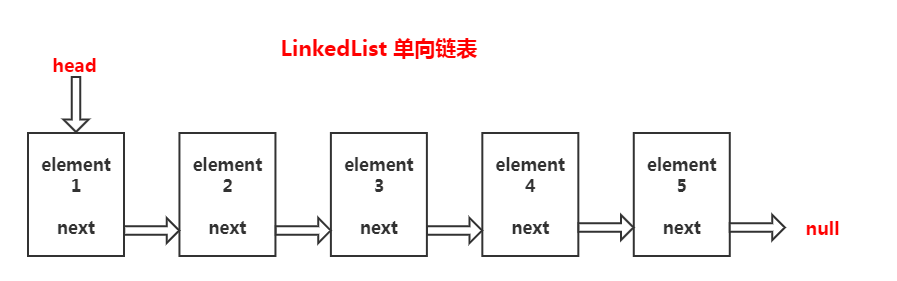
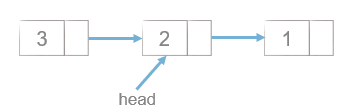
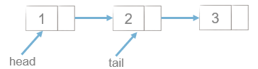
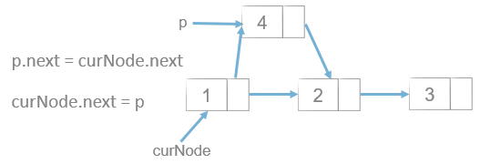
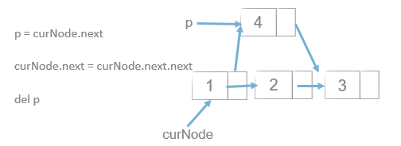
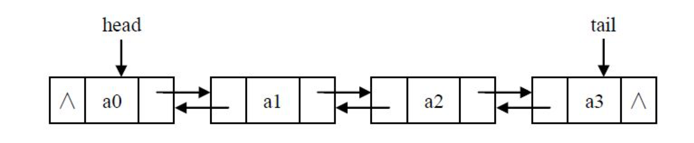

# 链表
**链表是由一系列节点组成的元素集合。每个节点包含两部分，数据域item和指向下一个节点的指针next。通过节点之间的互相连接，最终串联成一个链表。**



### 创建链表
- **头插法**



```python
def create_linklist_head(li):
    head = Node(li[0])
    for element in li[1:]:
        node = Node(element)
        node.next = head
        head = node
    return head
```

- **尾插法**



```python
def create_linklist_tail(li):
    head = Node(li[0])
    tail = head
    for element in li[1:]:
        node = Node(element)
        tail.next = node
        tail = node
    return head
```

### 链表的插入和删除



```python
# 查找到链表中值的对象
def select_node(lk, value):
    while lk:
        if lk.item == value:
            return lk
        lk = lk.next

# 向链表中插入新的对象
def insert_node(val_lk, node):
    node.next = val_lk.next
    val_lk.next = node


```



```python
# 删除链表中的对象
def delete_node(lk, value):
    tmp = None
    while lk:
        if lk.item == value:
            tmp.next = lk.next
        tmp = lk
        lk = lk.next
```
## 双向链表
**双链表的每个节点有两个指针：一个指向后一个节点，另一个指向前一个节点。**



```python
class Node:
    def __init__(self, item):
        self.item = item
        self.next = None
        self.prior = None
        
def create_linked_list(li):
    head = Node(li[0])
    tail = head
    for element in li[1:]:
        node = Node(element)
        node.prior = tail
        tail.next = node
        tail = tail.next
    return head
```
