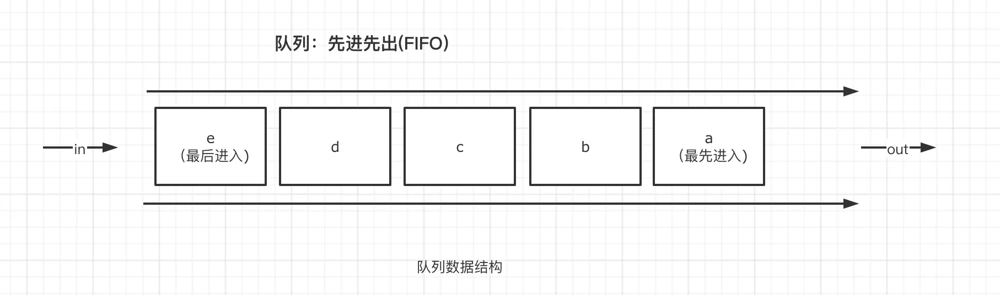
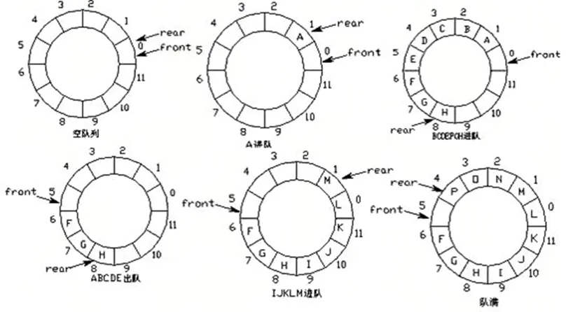

# 队列(Queue)
**队列是一个数据集合，仅允许在列表的一端进行插入，另一端进行删除。**



- 进行插入的一端称为队尾(rear)，插入动作称为进队或入队
- 进行删除的一端称为对头(front)，删除动作称为出队
- 队列的性质：先进先出(First-in，First-out)

## 队列的实现方式

### 环形队列



**环形队列：当队尾指针front == Maxsize+1时，再前进一个位置自动到0.**

- 队首指针前进1：front = (front + 1)%MaxSize
- 队尾指针前进1：rear = (rear + 1)%MaxSize
- 队空条件：rear == front
- 队满条件：(rear + 1)%MaxSize == front

```python
class Queue:
    def __init__(self, size=100):
        # 创建一个队列
        self.queue = [0 for _ in range(size)]
        self.size = size
        self.front = 0  #队首指针
        self.rear = 0   #队尾指针

    # 向队列中插入数据
    def push(self, element):
        # 是否为满队列
        if not self.is_filled():
            self.rear = (self.rear + 1) % self.size
            self.queue[self.rear] = element
        else:
            raise IndexError('Queue is filled.')

    # 删除队列
    def pop(self):
        # 是否为空队列
        if not self.is_empty():
            self.front = (self.front + 1) % self.size
            return self.queue[self.front]
        else:
            raise IndexError('Queue is empty.')

    # 判断是否空队列
    def is_empty(self):
        return self.rear == self.front

    # 判断是否满队列
    def is_filled(self):
        return self.front == (self.rear + 1) % self.size
```

### 双向队列
**双向队列的两端都支持进队和出队操作**

#### Python队列内置模块
使用方法：from collections import deque 

**双向队列的基本操作：**

- 队首进队   append()
- 队首出队   popleft()
- 队尾进队   applendleft()
- 队尾出队   pop()

#### 使用deque实现读取文件后n行

```python
from collections import deque
def tail(n):
    with open('tail.txt', 'r') as f:
        q = deque(f,n)
        return q
for line in tail(4):
    print(line,end='')
```
