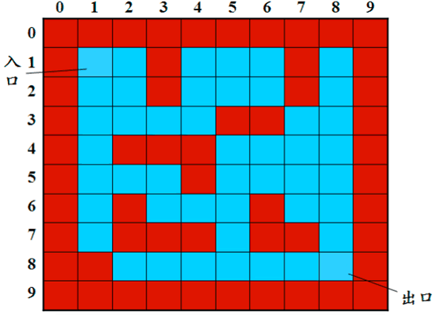
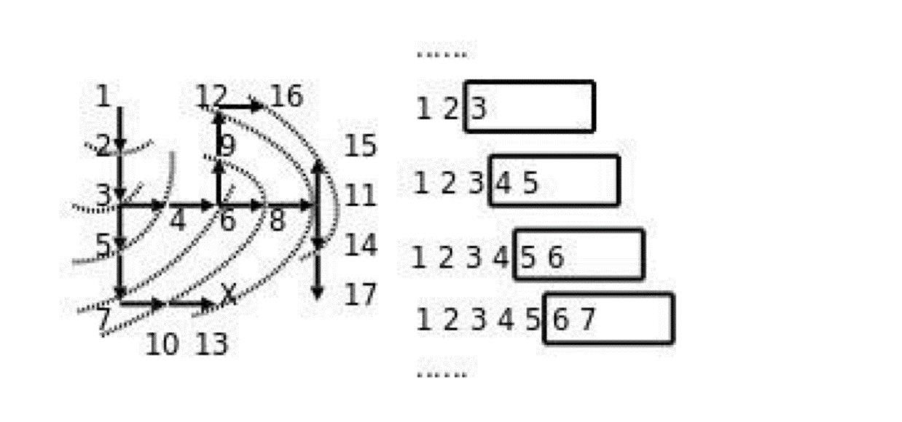

## 栈和队列的应用--迷宫问题
**给一个二维列表，表示迷宫(0表示通道，1表示围墙)。给出算法，求出一条走出迷宫的路径。**



### 栈--深度优先搜索
- 回溯法
- 思路：从一个节点开始，任意找下一个能走的点，当找不到能走的点时，退回上一个点寻找是否有其他方向的点。
- 使用栈存储当前路径

```python
maze = [
    [1, 1, 1, 1, 1, 1, 1, 1, 1, 1],
    [1, 0, 0, 1, 0, 0, 0, 1, 0, 1],
    [1, 0, 0, 1, 0, 0, 0, 1, 0, 1],
    [1, 0, 0, 0, 0, 1, 1, 0, 0, 1],
    [1, 0, 1, 1, 1, 0, 0, 0, 0, 1],
    [1, 0, 0, 0, 1, 0, 0, 0, 0, 1],
    [1, 0, 1, 0, 0, 0, 1, 0, 0, 1],
    [1, 0, 1, 1, 1, 0, 1, 1, 0, 1],
    [1, 1, 0, 0, 0, 0, 0, 0, 0, 1],
    [1, 1, 1, 1, 1, 1, 1, 1, 1, 1]
]

dirs = [
    lambda x,y: (x+1,y),    # 向上走
    lambda x,y: (x-1,y),    # 向下走
    lambda x,y: (x,y-1),    # 向左走
    lambda x,y: (x,y+1)     # 向右走
]

# (x1, y1)代表起点；(x2, y2)代表终点
def maze_path(x1 ,y1 ,x2 ,y2):
    stack = [(x1,y1)]
    while (len(stack)) > 0:
        curNode = stack[-1] #把当前节点存起来
        # 如果当前节点的x，y 等于 终点节点x，y说明已经到达终点
        if curNode[0] == x2 and curNode[1] ==y2:
            for s in stack:
                print(s)
            print(len(stack))
            return True

        for dir in dirs:
            nextNode = dir(curNode[0],curNode[1])
            # 如果下一个节点为0 说明可以走
            if maze[nextNode[0]][nextNode[1]] == 0:
                stack.append(nextNode)
                maze[nextNode[0]][nextNode[1]] = 2  #将走过的节点标识为2
                break

        #当上下左右都走不通时，就往回走
        else:
            stack.pop() 
    else:
        return False
```

### 队列--广度优先搜索
- 思路：从一个节点开始，寻找所有接下来能继续走的点，继续不断寻找，直到找到出口。
- 使用队列存储当前正在考虑的节点



```python
from collections import deque
maze = [
    [1, 1, 1, 1, 1, 1, 1, 1, 1, 1],
    [1, 0, 0, 1, 0, 0, 0, 1, 0, 1],
    [1, 0, 0, 1, 0, 0, 0, 1, 0, 1],
    [1, 0, 0, 0, 0, 1, 1, 0, 0, 1],
    [1, 0, 1, 1, 1, 0, 0, 0, 0, 1],
    [1, 0, 0, 0, 1, 0, 0, 0, 0, 1],
    [1, 0, 1, 0, 0, 0, 1, 0, 0, 1],
    [1, 0, 1, 1, 1, 0, 1, 1, 0, 1],
    [1, 1, 0, 0, 0, 0, 0, 0, 0, 1],
    [1, 1, 1, 1, 1, 1, 1, 1, 1, 1]
]
dirs = [
    lambda x,y: (x+1,y),    # 向上走
    lambda x,y: (x-1,y),    # 向下走
    lambda x,y: (x,y-1),    # 向左走
    lambda x,y: (x,y+1)     # 向右走
]

def print_r(path):
    curNode = path[-1]
    realpath = []
    while curNode[2] != -1:
        realpath.append(curNode[0:2])
        curNode = path[curNode[2]]
    realpath.append(curNode[0:2])
    realpath.reverse()
    for node in realpath:
        print(node)

def deque_maze_path(x1 ,y1 ,x2 ,y2):
    queue = deque()     # 创建队列
    queue.append((x1,y1,-1))    # 先把起点放到队列中
    path = []   # 存放走的坐标
    while len(queue) > 0:
        curNode = queue.popleft()
        path.append(curNode)
        if curNode[0] == x2 and curNode[1] == y2:
            print_r(path)
            return True
        for dir in dirs:
            nextNode = dir(curNode[0], curNode[1])
            if maze[nextNode[0]][nextNode[1]] == 0:     #判断是否可以走
                queue.append((nextNode[0],nextNode[1],len(path)-1))    #将可以走的位置加入到队列中
                maze[nextNode[0]][nextNode[1]] = 2  # 将走过的位置改为2
    else:
        print('没有路！')
        return False
```
