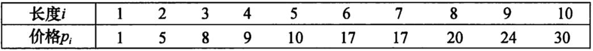
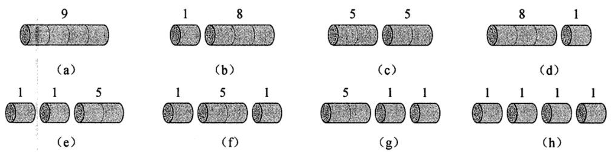
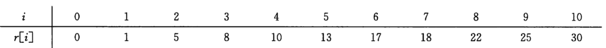
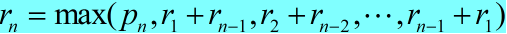
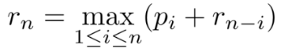
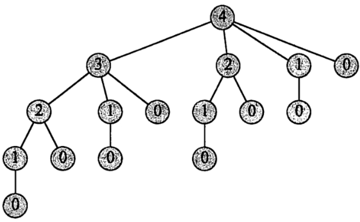
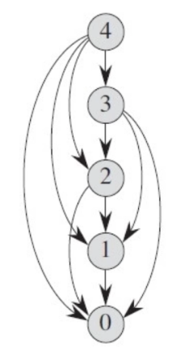
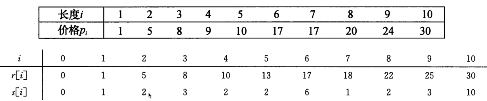
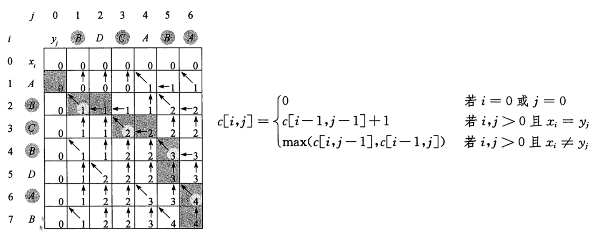

# 动态规划
**动态规划（Dynamic Programming，DP）是运筹学的一个分支，是求解决策过程最优化的过程。20世纪50年代初，美国数学家贝尔曼（R.Bellman）等人在研究多阶段决策过程的优化问题时，提出了著名的最优化原理，从而创立了动态规划。动态规划的应用极其广泛，包括工程技术、经济、工业生产、军事以及自动化控制等领域，并在背包问题、生产经营问题、资金管理问题、资源分配问题、最短路径问题和复杂系统可靠性问题等中取得了显著的效果**

## 斐波那契数列
公元 1202 年，意大利数学家莱昂纳多·斐波那契提出了具备以下特征的数列：
- 前两个数的值分别为 0 、1 或者 1、1；
- 从第 3 个数字开始，它的值是前两个数字的和；
为了纪念他，人们将满足以上两个特征的数列称为斐波那契数列。

如下就是一个斐波那契数列：
1 1 2 3 5 8 13 21 34......

### **递归速度问题-子问题重复计算**

递归是一种**自顶向下**的、很直观的编程方法，解释性强。但在写递归的时候，最关键的问题是怎样避免递归过程中可能产生的大量重复计算，即重叠子问题，否则，写出来的代码即便没有逻辑错误，也几乎会因为超时无法运行

```python
def fibnacci(n):
    if n == 1 or n == 2:
        return 1
    else:
        return fibnacci(n-1) + fibnacci(n-2)
```

```text
f(5) = f(4)+f(3)
f(4) = f(3)+f(2)
f(3) = f(2)+f(1)
f(2) = 1
f(1) = 1
```

### **动态规划思想 = 最优子结构 = 递推式**

```python
def fibnacci_no_rec(n):
    f = [0, 1]
    if n > 2:
        for i in range(n-2):
            num = f[-1]+f[-2]
            f.append(num)
    return f[n]
```

## 钢条切割问题
**钢条，价格与钢条长度之间的关系如下表：**



**现在有一段长度为n的钢条和价格表，求收益最大方案。**

- 长度为4的钢条最优方案是c



- 钢条长度和价格最优关系表：




### 长度是n的钢条切割方案
**递推式**

- 设长度为n的钢条切割后最优收益值为rn，可以得出递推式：
  - 
- 第一个参数pn表示不切割的价格
- 其他n-1个参数分别表示另外n-1种不同切割方案，对方案i=1,2,...,n-1
  - 将钢条切割长度为i和n-i两段
  - 方案i的最优收益为切割两段最优之和
- 考察所有的i，选择其中收益最大的方案。

**最优子结构**

可以将求解规模为n的原问题，划分为规模更小的子问题：
- 钢条切割问题还存在更简单的递归求解方法
  - 从钢条的左边切割下长度为i的一段，只对右边剩下的一段继续进行切割，左边的不在切割
  - 递推式简化为
  - 不做切割的方案就可以描述为：左边一段长度为n，收益为pn，剩余一段长度为0，收益为r0=0

#### 自顶向下实现 -- O(2^n)



```python
p = [0, 1, 5, 8, 9, 10, 17, 17, 20, 21, 23, 24, 26, 27, 27, 28, 30, 33, 36, 39, 40]

def cut_rod_rec(p, n):
    if n == 0:
      return 0
    res = 0
    for i in range(1, n):
        res = max(res, cut_rod_rec(p, i) + cut_rod_rec(p, n - i))
    return res

def cut_rod_rec_2(p, n):
    if n == 0:
      return 0
    res = 0
    for i in range(1, n):
        res = max(res, p[i] + cut_rod_rec_2(p, n - i))
    return res
```

#### 自底向上 -- O(n^2)

**由于每次都是直接取之前存好的值。**



```python
def cut_rod_dp(p ,n):
    r = [0]
    for i in range(1, n+1):
        res = 0
        for j in range(1, i+1):
            res = max(res, r[i-j]+p[j])
        r.append(res)
    return r[n]
```

#### 重构解

- 输出最优切割方案



```python
def cut_rod_extent(p, n):
    r = [0]     # 最优解
    s = [0]     # 切割后左边的长度
    for i in range(1, n+1):
        res_r = 0
        res_s = 0
        for j in range(1, i+1):
            if p[j] + r[i-j] > res_r:
                res_r = p[j] + r[i-j]
                res_s = j
        r.append(res_r)
        s.append(res_s)
    return r[n], s

def cut_rod_solution(p, n):
    r, s = cut_rod_extent(p, n)
    end = []
    while n > 0:
        end.append(s[n])
        n -= s[n]
    return end
```

### 动态规划问题特征

- 最优子结构
- 重叠子问题

## 最长公共子序列
**一个序列的子序列是在该序列中删去若干元素后得到的序列。例如：“ABCD”和“BDF”都是“ABCDEFG”的子序列。**

**最长公共子序列（Longest Common Subsequence,简写LCS）问题：给定两个序列X和Y，求X和Y长度最大的公共子序列。例如：X=“ABBCBDE”, Y="DBBCDB", LCS(X,Y)="BBCD"**

### 最优子结构原理
X=<x1,x2,...,xm>和Y=<y1,y2,...,yn>为两个序列，Z=<z1,z2,...,zk>为X和Y的任意LCS。
- 如果xm=yn，则zk=xm=yn且Zk-1是Xm-1和Yn-1的一个LCS。
- 如果xm≠yn，那么zk≠xm意味着Z是Xm-1和Y的一个LCS。
- 如果xm≠yn，那么zk≠yn意味着Z是X和Yn-1的一个LCS。

### 递推式



```python
def lcs_length(x, y):
    m = len(x)
    n = len(y)
    c = [[0 for _ in range(n+1)] for _ in range(m+1)]
    for i in range(1, m+1):
        for j in range(1, n+1):
            if x[i-1] == y[j-1]:
                c[i][j] = c[i-1][j-1]+1
            else:
                c[i][j] = max(c[i-1][j],c[i][j-1])

    for _ in c:
        print(_)

    return c[m][n]

def lcs(x, y):
    m = len(x)
    n = len(y)
    c = [[0 for _ in range(n + 1)] for _ in range(m + 1)]
    b = [[0 for _ in range(n + 1)] for _ in range(m + 1)]  # 左上方  上方  左方
    for i in range(1, m + 1):
        for j in range(1, n + 1):
            if x[i - 1] == y[j - 1]:  # i,j位置上的字符匹配的时候，来自于左上方+1
                c[i][j] = c[i - 1][j - 1] + 1
                b[i][j] = 1
            elif c[i - 1][j] >= c[i][j - 1]:  # 来自于上方(这里把等于也偏向上)
                c[i][j] = c[i - 1][j]
                b[i][j] = 2
            else:  # 来自于左方
                c[i][j] = c[i][j - 1]
                b[i][j] = 3
    return c[m][n], b

c, b = lcs("ABCBDAB", "BDCABA")

for _ in b:
    print(_)

def lcs_trackback(x,y):
    c, b = lcs(x, y)
    i = len(x)
    j = len(y)
    res = []
    while i > 0 and j > 0:
        if b[i][j] == 1:   # 来自左上方 -- 匹配
            res.append(x[i-1])
            i -= 1
            j -= 1
        elif b[i][j] == 2:   # 来自于上方 -- 不匹配
            i -= 1
        else:       # ==3,来自左方 -- 不匹配
            j -= 1
    print(res)
    return "".join(reversed(res))
```
