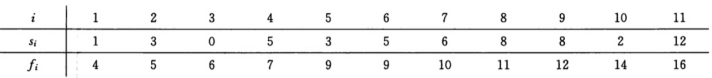

# 贪心算法
**贪心算法（又称贪婪算法）是指，在对问题求解时，总是做出在当前看来是最好的选择。也就是说，不从整体最优上加以考虑，他所做出的是在某种意义上的局部最优解。**

贪心算法并不保证会得到最优解，但是在某些问题上贪心算法的解就是最优解。要判断一个问题能否用贪心算法来计算。

## 一、找零问题
**假设商店老板需要找零n元钱，钱币的面额有：100元、50元、20元、5元、1元，如何找零使得所需钱币的数量最小？**

```python
def change(t, n):
    m = [0 for _ in range(len(t))]
    for i, money in enumerate(t):
        m[i] = n // money
        n = n % money
    return m, n
```

## 二、背包问题
**背包问题(Knapsack problem)是一种组合优化的NP完全问题。 问题可以描述为：给定一组物品，每种物品都有自己的重量和价格，在限定的总重量内，我们如何选择，才能使得物品的总价格最高。 问题的名称来源于如何选择最合适的物品放置于给定背包中。**

一个小偷在某个商店发现有n个商品，第i个商品价值vi元，重wi千克。他希望拿走的价值尽量高，但他的背包最多只能容纳W千克的东西。他应该拿走哪些商品？

- 0-1背包

  对于一个商品，小偷要么把它完整拿走，要么留下。不能只拿走一部分，或把一个商品拿走多次。

- 分数背包
  
  对于一个商品，小偷可以拿走其中任意一部分。


```python
goods = [(60 ,10) ,(100 ,20) ,(120 ,30)]    # （价格，重量）
goods.sort(key=lambda x: x[0]/x[1] ,reverse = True)     # 根据商品单价排序

def fraction_backpack(goods, w):
    m =[0 for _ in range(len(goods))]
    total_v = 0
    for i,(price,weight) in enumerate(goods):
        if weight < w:
            m[i] = 1
            total_v += price
            w -= weight
        else:
            m[i] = w / weight
            total_v += price * m[i]
            break
    return m ,total_v
```

## 三、拼接最大数字问题
**有n个非负整数，将其按照字符串拼接的方式拼接为一个整体。如何拼接可以使得得到的整数最大？**

```python
def xy_cap(x, y):
    if x + y < y + x:
        return 1
    elif x + y > y + x:
        return -1
    else:
        return 0

def number_join(li):
    li = list(map(str, li))
    li.sort(key=cmp_to_key(xy_cap))
    return "".join(li)
```
## 四、活动选择问题
假设有n个活动，这些互动要占用同一片场地，而场地在某时刻只能供一个活动使用。

每个活动都有一个开始时间si和结束时间fi（题目中时间以整数表示），表示活动在[si, fi)（左闭右开）区间占用场地。

问：安排哪些活动能够使该场地举办的活动个数最多？



- 贪心结论：**最先结束的活动一定是最优解的一部分**。
- 假设a是所有活动中最先结束的活动，b是最优解中最先结束的活动。
  - 如果a=b,结论成立
  - 如果a不等b，则b的结束时间一定晚于a的结束时间，则此时用a替换掉最优解中的b，一定不与最优解中的其他活动时间重叠，因此替换后的解也是最优解。

```python
activities = [(1, 4), (3, 5), (0, 6), (5, 7), (3, 9), (5, 9), (6, 10), (8, 11), (8, 12), (2, 14), (12, 16)]
activities.sort(key=lambda x: x[1])  # 以结束时间排序

def activities_seletion(a):
    res = [a[0]]
    for i in range(1, len(a)):
        if res[-1][1] < a[i][0]:
            res.append(a[i])
    return res
```
